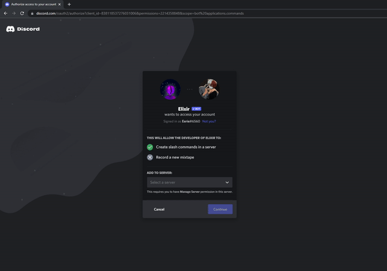
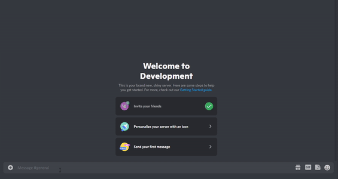
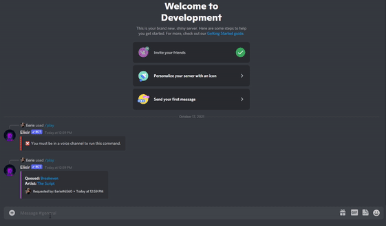
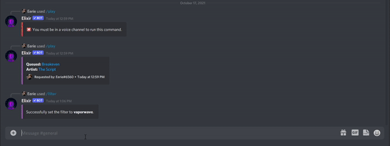
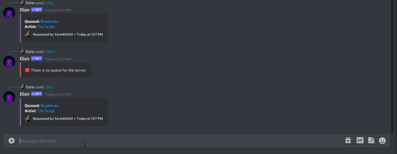
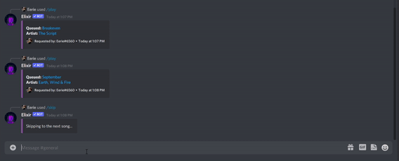

## Getting Started

This is a quick tutorial on how to add Elixir Music to your server and how to use its commands.

## Invite Elixir

The first thing you'll need to do is invite Elixir to your Discord server.
First, use the invite link directly. You can do so by typing in [https://ponjo.club/invites/elixir](https://ponjo.club/invites/elixir) in your browser.

Once you've navigated to this page and logged into your Discord account, the next step is to select a server to add Elixir to from the dropdown menu.

::: warning Slash Command Scope

Make sure the first page that shows up asks you to allow Elixir to create slash commands in your server. If this scope is not added or this message cannot be seen, you're not authorizing the correct application scopes and need to use the direct link.

:::

Upon authorizing Elixir to create slash commands, you'll then be directed to a permission menu. It is recommended to leave every position checked in order to avoid running into issues when trying to run music commands.

Finally, complete the captcha. Congrats, Elixir is now added to your server!

Upon inviting Elixir, you'll notice that quite a few slash commands have been added to your server. That's great! We'll use them to play music.

## Playing Songs

Elixir supported platforms like Spotify and SoundCloud. Unfortunately, due to recent events, Elixir no longer supports YouTube URLs or YouTube videos. In order to play a song or playlist, use the `/play` command, followed by the song name or URL. For the best accuracy, use Spotify song URLs. To avoid ratelimiting, only the first 100 songs of a playlist can be added to the queue at once.

## Adding Filters

You can add a variety of filters to your songs to give them a different feel. To do so, run the `/filter` command.

## Viewing the Queue

You can also view all the songs that are in the server queue. To do so, run the `/queue` command as shown below.

## Skipping Songs

You can skip the song currently playing and play the next one in the queue by using the `/skip` command. If there are no more songs left in the queue to play, Elixir will leave the voice channel.

## Changing the Volume

You can also modify the volume of the songs being played. Run the `/volume` command, and then select an amplifier from the menu to either increase or decrease the output volume. This feature is commonly used to improve bitrate.

## Questions

If you have any questions on how to use Elixir or would like to report a bug, don't hesitate to contact us on our [Discord server.](https://ponjo.club/discord)