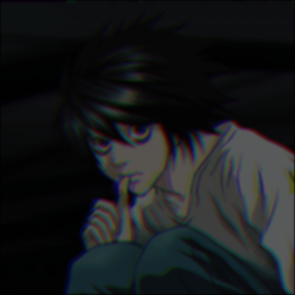
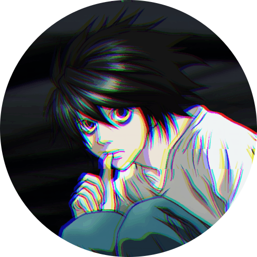
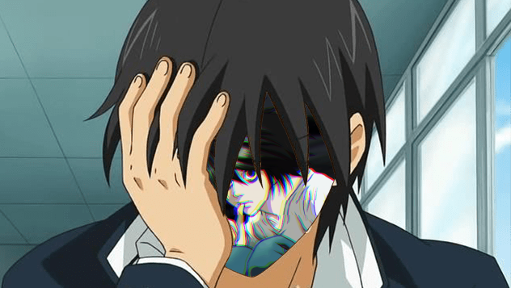
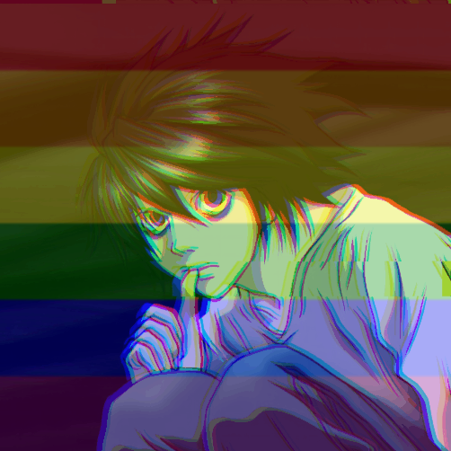
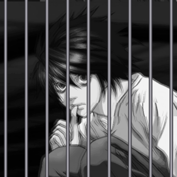
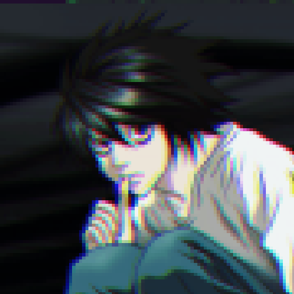
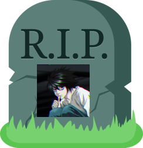
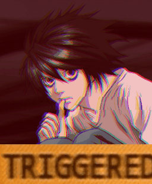

## /v1/burn

- Add a burning effect to an image.
- Request method: `POST`

| **Parameter** | **Type** | **Details** | **Required** |
| :---: | :---: | :---: | :---: |
| `image` | `URL string` | The image to modify. | `true` |
| `intensity` | `integer` | The intensity of the burning effect. | `false` |
| `format` | `string <png:jpg>` | The format of the image. | `false` |
| **Header** | **Type** | **Description** | **Required** |
| Authorization | `string` | Your API access key. | `true` |
| Connection | `string` | `keep-alive` | `false` |

### Sample Response

🟢 **Status: 200** ─ Success.

## /v1/circle

- Add a circular crop to an image.
- Request method: `POST`

| **Parameter** | **Type** | **Details** | **Required** |
| :---: | :---: | :---: | :---: |
| `image` | `URL string` | The image to modify. | `true` |
| `format` | `string <png:jpg>` | The format of the image. | `false` |
| **Header** | **Type** | **Description** | **Required** |
| Authorization | `string` | Your API access key. | `true` |
| Connection | `string` | `keep-alive` | `false` |

### Sample Response

🟢 **Status: 200** ─ Success.

## /v1/facepalm

- Add a facepalm effect to an image.
- Request method: `POST`

| **Parameter** | **Type** | **Details** | **Required** |
| :---: | :---: | :---: | :---: |
| `image` | `URL string` | The image to modify. | `true` |
| `format` | `string <png:jpg>` | The format of the image. | `false` |
| **Header** | **Type** | **Description** | **Required** |
| Authorization | `string` | Your API access key. | `true` |
| Connection | `string` | `keep-alive` | `false` |

### Sample Response

🟢 **Status: 200** ─ Success.

## /v1/gay

- Add a gay filter over an image.
- Request method: `POST`

| **Parameter** | **Type** | **Details** | **Required** |
| :---: | :---: | :---: | :---: |
| `image` | `URL string` | The image to modify. | `true` |
| `format` | `string <png:jpg>` | The format of the image. | `false` |
| **Header** | **Type** | **Description** | **Required** |
| Authorization | `string` | Your API access key. | `true` |
| Connection | `string` | `keep-alive` | `false` |

### Sample Response

🟢 **Status: 200** ─ Success.

## /v1/jail

- Add a jailed effect to an image.
- Request method: `POST`

| **Parameter** | **Type** | **Details** | **Required** |
| :---: | :---: | :---: | :---: |
| `image` | `URL string` | The image to modify. | `true` |
| `format` | `string <png:jpg>` | The format of the image. | `false` |
| **Header** | **Type** | **Description** | **Required** |
| Authorization | `string` | Your API access key. | `true` |
| Connection | `string` | `keep-alive` | `false` |

### Sample Response

🟢 **Status: 200** ─ Success.

## /v1/pixelate

- Add pixelation to an image.
- Request method: `POST`

| **Parameter** | **Type** | **Details** | **Required** |
| :---: | :---: | :---: | :---: |
| `image` | `URL string` | The image to modify. | `true` |
| `pixels` | `integer` | The amount of pixels. | `false` |
| `format` | `string <png:jpg>` | The format of the image. | `false` |
| **Header** | **Type** | **Description** | **Required** |
| Authorization | `string` | Your API access key. | `true` |
| Connection | `string` | `keep-alive` | `false` |

### Sample Response

🟢 **Status: 200** ─ Success.

## /v1/rip

- Add a "RIP" effect to an image.
- Request method: `POST`

| **Parameter** | **Type** | **Details** | **Required** |
| :---: | :---: | :---: | :---: |
| `image` | `URL string` | The image to modify. | `true` |
| `format` | `string <png:jpg>` | The format of the image. | `false` |
| **Header** | **Type** | **Description** | **Required** |
| Authorization | `string` | Your API access key. | `true` |
| Connection | `string` | `keep-alive` | `false` |

### Sample Response

🟢 **Status: 200** ─ Success.

## /v1/trigger

- Add a triggered effect to an image.
- Request method: `POST`

| **Parameter** | **Type** | **Details** | **Required** |
| :---: | :---: | :---: | :---: |
| `image` | `URL string` | The image to modify. | `true` |
| `format` | `string <png:jpg>` | The format of the image. | `false` |
| **Header** | **Type** | **Description** | **Required** |
| Authorization | `string` | Your API access key. | `true` |
| Connection | `string` | `keep-alive` | `false` |

### Sample Response

🟢 **Status: 200** ─ Success.

